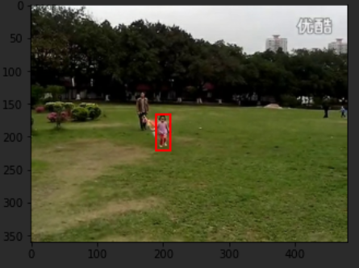
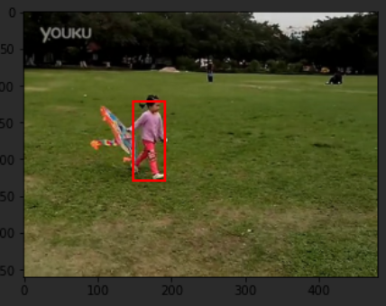

# Object Tracking Code Migration (Tracking Only)

이 레포는 https://github.com/bertinetto/cfnet 레포에 나와있는 코드를 정리하고 python 2.x를 python 3.x에 맞게 수정한것에 불과 하다. 또한 논문 2편을 읽고 느낀점(?)을 정리했다.

[Fully-Convolutional Siamese Networks for Object Tracking](https://arxiv.org/abs/1606.09549)

[End-to-end representation learning for Correlation Filter based tracking](https://arxiv.org/abs/1704.06036)


## Tutorial

```bash
pip install -r "requirements.txt"
# data, pretrained model 다운 받기(원래 레포에 다운 링크가 있다.)
vim evaluation.json # "video" : "all" 부분을 내가 원하는 비디오 이름으로 변경
# jupyter notebook 실행
```


## 논문 요약?

도큐먼트를 참고


## 기존 코드 분석 및 이해

1. 분석 대상 정하기

`run_tracker_evaluation.py` 의 16번째 라인에 다음과 같은 코드가 있다.

```python
hp, evaluation, run, env, design = parse_arguments()
```

` parse_arguments.py`의 `parse_arguments()` 함수를 확인해 보면 `parameters/evaluation.json` 이라는 파일에서 설정값을 읽어오는 것을 알 수 있다.

```json
{
	"n_subseq": 3,
	"dist_threshold": 20,
	"stop_on_failure": 0,
	"dataset": "validation",
	"video": "all", // data sequece의 이름을 넣거나 전체일 경우 'all'
	"start_frame": 0  // 항상 처음 사진이 exampler가 된다.
} 
```

2. 모델 구현 하기

`run_tracker_evaluation.py` 파일에 다음과 같은 코드가 있다. siamese 네트워크를 만드는 함수로 보인다 직접 확인해보자.

```
# build TF graph once for all
filename, image, templates_z, scores = siam.build_tracking_graph(final_score_sz, design, env)
```


이 코드가 모델을 구현하는 코드이다. 이 코드 중에서 중요한 부분만 짤라서 보자.

```
def build_tracking_graph(final_score_sz, design, env):
    filename = tf.placeholder(tf.string, [], name='filename')
    image_file = tf.read_file(filename)
    image = tf.image.decode_image(image_file)
    image = 255.0 * tf.image.convert_image_dtype(image, tf.float32)
    frame_sz = tf.shape(image)
    if design.pad_with_image_mean:
        avg_chan = tf.reduce_mean(image, axis=(0,1), name='avg_chan')
    else:
        avg_chan = None
    # padding image
    frame_padded_z, npad_z = pad_frame(image, frame_sz, pos_x_ph, pos_y_ph, z_sz_ph, avg_chan)
    frame_padded_z = tf.cast(frame_padded_z, tf.float32)
    # extract tensor of z_crops
    z_crops = extract_crops_z(frame_padded_z, npad_z, pos_x_ph, pos_y_ph, z_sz_ph, design.exemplar_sz)
    frame_padded_x, npad_x = pad_frame(image, frame_sz, pos_x_ph, pos_y_ph, x_sz2_ph, avg_chan)
    frame_padded_x = tf.cast(frame_padded_x, tf.float32)
    # extract tensor of x_crops (3 scales)
    x_crops = extract_crops_x(frame_padded_x, npad_x, pos_x_ph, pos_y_ph, x_sz0_ph, x_sz1_ph, x_sz2_ph, design.search_sz)
    template_z, templates_x, p_names_list, p_val_list = _create_siamese(os.path.join(env.root_pretrained,design.net), x_crops, z_crops)
    template_z = tf.squeeze(template_z)
    templates_z = tf.stack([template_z, template_z, template_z])
    # compare templates via cross-correlation
    scores = _match_templates(templates_z, templates_x, p_names_list, p_val_list)
    # upsample the score maps
    scores_up = tf.image.resize_images(scores, [final_score_sz, final_score_sz],
        method=tf.image.ResizeMethod.BICUBIC, align_corners=True)
    return filename, image, templates_z, scores_up
```


이미지를 불러오는 부분이다.

```python
image_file = tf.read_file(filename)
image = tf.image.decode_image(image_file)
```


하나의 이미지에서 object가 포함된 부분의 이미지를 잘라서 training image로 사용하는 부분이다.  코드를 좀 더 설명하자면 pos_x, pos_y 정보는 는 이미 `ground_truth.txt`라는 텍스트 파일안에 프레임마다 오브젝트의 위치가 기록되어 있어서 그곳에서 가져온다. 그리고 z_sz_ph는 crop된 이미지를 그대로 사용하지 않고 resize 시키는데 필요한 resized된 크기를 의미한다. 그래서 결론은 frame_padded_z(그냥 image에서 padding 한 이미지) 이미지를 pos_x, pos_y위치에서 crop한 뒤 z_sz_ph의 크기로 resize하는 것이다.

```python
# extract tensor of z_crops
z_crops = extract_crops_z(frame_padded_z, npad_z, pos_x_ph, pos_y_ph, z_sz_ph, design.exemplar_sz)
```


그리고 searching image로 사용할 이미지를 crop해야하는데 이렇게 crop하는 영역은 해당 프레임의 전 프레임에서의 위치를 기반으로 crop하고 각기 다른 size의 이미지로 총 3장 만들어낸다.

```python
x_crops = extract_crops_x(frame_padded_x, npad_x, pos_x_ph, pos_y_ph, x_sz0_ph, x_sz1_ph, x_sz2_ph, design.search_sz)
```


이 부분에서는 training image, seaching image를 input으로 하는 두개의 cnn 네트워크를 만든다. parameter들은 matlab에서 학습 시킨 파라미터들을 그대로 불러와서 사용한다. 여기서 `_import_from_matconvnet` 함수가 파라미터들을 불러오고 불러온 파라미터들을 사용해 tensorflow 모델을 `set_convolution()`함수에서 만든다.

```python
template_z, templates_x, p_names_list, p_val_list = _create_siamese(os.path.join(env.root_pretrained,design.net), x_crops, z_crops)

def _create_siamese(net_path, net_x, net_z):
    # read mat file from net_path and start TF Siamese graph from placeholders X and Z
    params_names_list, params_values_list = _import_from_matconvnet(net_path)
    #...생략...
    # set up conv "block" with bnorm and activation
        net_x = set_convolutional(net_x, conv_W, np.swapaxes(conv_b,0,1), _conv_stride[i], \
                            bn_beta, bn_gamma, bn_moving_mean, bn_moving_variance, \
                            filtergroup=_filtergroup_yn[i], batchnorm=_bnorm_yn[i], activation=_relu_yn[i], \
                            scope='conv'+str(i+1), reuse=False)
    #...생략...
    return net_z, net_x, params_names_list, params_values_list
```


두개의 모델이 만들어졌다면 두개의 모델의 output, 즉 emedding vector를 correlation layer의 input으로 대입해야 한다. 이 부분은 `_match_templates`의 코드 일부분을 보면 확인할 수 있다.

```python
def _match_templates(net_z, net_x, params_names_list, params_values_list):
    # ...생략
    net_z = tf.reshape(net_z, (Hz, Wz, B*C, 1))
    net_x = tf.reshape(net_x, (1, Hx, Wx, B*C))
    net_final = tf.nn.depthwise_conv2d(net_x, net_z, strides=[1,1,1,1], padding='VALID')
    # ...생략
```


3. 모델을 통해서 evaluation 결과 보기

원래 repo에서 제시하는 정확도에 한참 못 및칠 뿐더러 아예 말이 안되는 정확도가 나왔다. 아마 파이썬으로 여러개 분리되어있는 코드를 내 멋대로 주피터 노트북으로 합쳐서 그런것 같다. 정확도는 총 3개로 볼 수 있다. Precision, distance(center to center), IOU(intersection rectangle)  내가 실행한 정확도와 원래 정확도를 표로 나타냈다.

|             Video             | Precision |  IOU  |
| :---------------------------: | :-------: | :---: |
|         All(Official)         |   69.41   | 50.18 |
| tc_Baby_ce(me doing it wrong) |   12.50   | 22.16 |
|                               |           |       |



